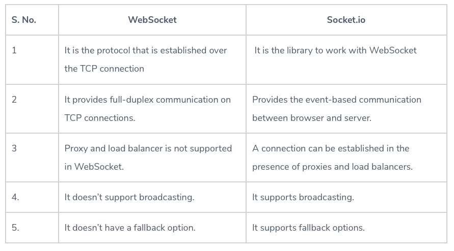

# Readings: Socket.io

## Reading

### [Web Sockets](https://en.wikipedia.org/wiki/WebSocket)

1. What is a Web Socket?

   WebSocket is a computer communications protocol, providing full-duplex communication channels over a single TCP connection.The WebSocket protocol enables interaction between a web browser (or other client application) and a web server with lower overhead than half-duplex alternatives such as HTTP polling, facilitating real-time data transfer from and to the server.

2. Describe the Web Socket request/response handshake and what happens once the connection is established.

   To establish a WebSocket connection, the client sends a WebSocket handshake request, for which the server returns a WebSocket handshake response.

3. Web Sockets provide a standardized way for the server to send content to a client without first receiving a **\_\_**\_\_ from that client.

   request

### [Socket.io Tutorial](https://www.tutorialspoint.com/socket.io/)

1. What does the event handler `io.on()` do?

   The io.on event handler handles connection, disconnection, etc., events in it, using the socket object.

2. Describe some possible proof of life or proof that the code works as expected

   If you successfully connected to the web socket you should see a log that a user has connected

3. What does socket.emit() do?

   socket.emit() fires the events

### [Socket.io vs Web Sockets](https://www.educba.com/websocket-vs-socket-io/)

1. What is the difference between WebSocket and Socket.IO? (think Git and GitHub, or OAuth and Auth0).

   - WebSocket is the communication Protocol that provides bidirectional communication between the Client and the Server over a TCP connection.
   - Socket.IO is a library that enables real-time and full-duplex communication between the Client and the Web servers. It uses the WebSocket protocol to provide the interface.

2. When would you use Socket.IO?

   - I handle all the degradation of your technical alternatives to get full-duplex communication in real-time.
   - It also handles the various support level and the inconsistencies from the browser.
   - It also gives the additional feature room support for basic publish infrastructure and thinks like automatic reconnect.
     Currently, AFAIK is the most used one and easier to help with vanilla web sockets.

3. When would you use WebSockets?

   - It provides full-duplex communication, which helps in persisting the connection established between the Client and the Web Server.
   - It also lives up to the standards and provides the accuracy and efficiency stream events to and from with negligible latency.
   - WebSocket removes the overhead and reduce complexity.
     It makes real-time communication effortless and efficient.

## Videos

[OSI Model Explained](https://www.youtube.com/watch?v=vv4y_uOneC0)

1. What are a couple of key takeaways from this video?

   There are many layer to to OSI model:

   - Application Layer
   - Presentation Layer
   - Session Layer
   - Transport Layer
   - Network Layer
   - Data Link Layer
   - Physical Layer

[TCP Handshakes Explained](https://www.youtube.com/watch?v=xMtP5ZB3wSk)

1. Translate the gist of this video to a non-technical friend

   TCP is a reliable and connection-oriented transport protocol. With TCP, data can be delivered successfully and accurately. Before TCP transmits data, it will use three-way handshake to establish a connection.

## Bookmark and Review

[Socket.io Documentation](https://socket.io/docs/)

[Socket.io Server API](https://socket.io/docs/server-api)

[Socket.io Client API](https://socket.io/docs/client-api)

[Socket Testing Tool](https://amritb.github.io/socketio-client-tool/)
