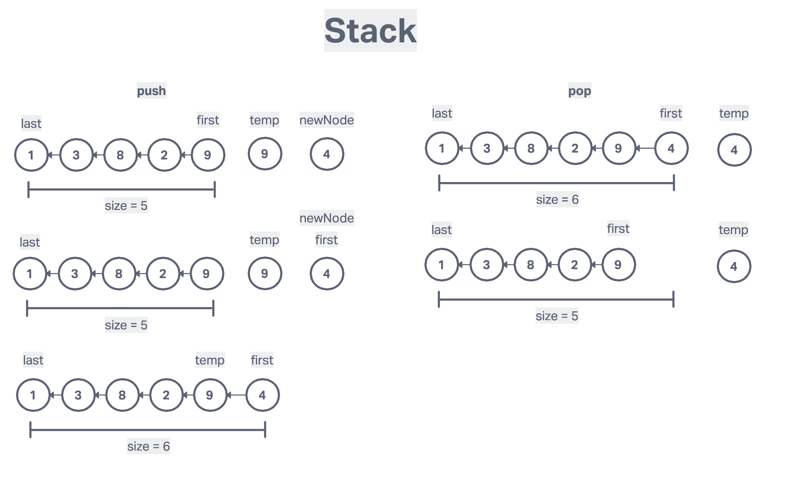
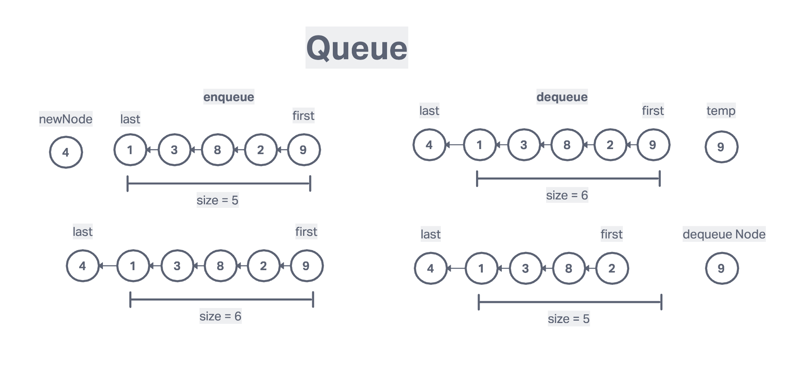

# Stacks and Queue

## Stack

LIFO (last in first out)

The last element added to teh stack will be the first element removed from the stack

## Queue

FIFO (first in first out)

A data structure that add to a queue and the last element will be the first to be removed from the stack. All elements are first in, first out.

